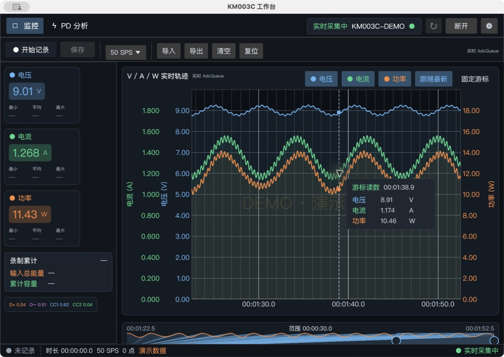

<h1 align="center">km003c-rs</h1>

<p align="center">Typed Rust library, CLI tools, GUI monitor, and Python bindings for the ChargerLAB POWER-Z KM003C USB-C power analyzer.</p>

<p align="center">
  <a href="https://crates.io/crates/km003c-lib"></a>
  <a href="https://docs.rs/km003c-lib"></a>
  
  <a href="https://github.com/okhsunrog/km003c-rs/actions/workflows/ci.yml"></a>
</p>

## Overview

`km003c-rs` provides asynchronous device communication, recorded-packet
parsing, real-time power analysis, and USB Power Delivery capture. Physical
values in the Rust API are type-safe [`uom`](https://docs.rs/uom) quantities.



## Features

### Device Communication
- Dual interface support: Vendor (bulk, ~0.6ms latency) or HID (interrupt)
- Cross-platform support using `nusb`
- Asynchronous communication with Tokio
- Automatic device discovery, initialization, and authentication

### ADC Data Acquisition
- Real-time voltage, current, and power measurements
- Two modes:
  - **Simple ADC**: Single-shot readings with temperature and statistics
  - **AdcQueue streaming**: High-speed continuous streaming (2, 10, 50, 1000 SPS)
- USB data line voltage measurements (D+, D-)
- USB-C CC line voltage measurements (CC1, CC2)

### USB Power Delivery Support
- Capture and parse USB PD messages
- Connection/disconnection event detection
- Full PD message parsing using the `usbpd` crate
- Support for SPR and EPR source capabilities
- Chunked message reassembly for EPR
- Typed firmware Type-C and protocol-engine state traces

### Device Information
- Model, firmware version, hardware version
- Serial number and UUID
- Hardware ID and authentication level

## Components

### `km003c-lib`
Core library providing:
- Device communication and automatic initialization
- Streaming authentication (required for AdcQueue)
- Firmware-selected calibration authentication for level-2 operations
- ADC and AdcQueue data parsing
- CRC-validated read-only device settings
- Offline recording catalog and encrypted log downloads
- USB PD event parsing
- Optional stateful USB PD semantic decoding through the `usbpd` feature
- Typed firmware PD state-trace parsing

### `km003c-cli`
Command-line tools:
- `adc_simple` - Single-shot ADC readings with device info
- `adc_queue_simple` - AdcQueue streaming demo
- `test_usbpd` - USB PD negotiation capture
- `offline-log` - List and export stored recordings as CSV or JSON

### `km003c-egui`
GUI application featuring:
- A no-scroll monitor workspace with grayscale voltage/current/power cards, colored channel rails, and tabular monospace readouts
- A recording-first combined V/A/W plot: live cards remain visible at idle, while waveform, navigator, and statistics appear only for an explicit recording or loaded file
- Full-session, latest 2s/10s/30s/1min/5min, and arbitrary manually selected chart ranges
- A fixed all/window information bar below the plot for duration, capacity, cumulative energy, and sample count
- A synchronized vertical cursor with nearest-sample voltage/current/power table and pin control
- A single normalized plot axis that avoids overlapping V/A/W scales; selectable channel chips show each real adaptive range in V/A/W, mV/mA/mW, or µV/µA/µW
- Default five-point median display filtering with a faint raw-spike envelope; recorded/exported samples remain raw
- A progressively compacted whole-session navigator that retains bucket extrema during long 1000 SPS runs
- Recording-scoped instrument cards with current, minimum, average, and maximum values
- Pixel-aware min/max plot downsampling and logarithmic-time cursor lookup
- AdcQueue streaming with configurable sample rates
- Adjustable time window (2s to 5min or all data)
- Immediate start, pause, resume, recoverable temporary capture, and safely finalized Parquet/CSV save
- Recording duration, direction-independent cumulative energy, accumulated capacity, signed net energy, and optional sustained-low-power auto-pause
- Strict import of KM003C 23-column Parquet/CSV recordings with schema and timestamp validation
- Device-stored offline recording catalog, download, plotting, and Parquet/CSV export
- Host-integrated charge and energy with explicit missing-sample quality data
- A typed current-protocol card that confirms Fixed/PPS/EPR/AVS only after Request, Accept, and PS_RDY
- Dedicated full-height PD analysis page for wire messages and firmware-state traces
- A grouped settings drawer with compact common sections and collapsed device, recovery, offline, diagnostic, and about sections
- Connect/disconnect control

### Python Bindings

Python bindings expose the parser using numeric properties with explicit unit
suffixes such as `vbus_v`, `ibus_a`, and `power_w`.

## Quick Start

### Prerequisites
- Rust 1.97+
- USB access permissions (udev rules on Linux)
- POWER-Z KM003C device

### Installation

```bash
git clone https://github.com/okhsunrog/km003c-rs.git
cd km003c-rs
cargo build --release
```

### Linux USB Permissions

Create udev rules for non-root access:

```bash
sudo cp 71-powerz-km003c.rules /etc/udev/rules.d/
sudo udevadm control --reload-rules
sudo udevadm trigger
```

The rules use the `uaccess` tag for secure, dynamic access to logged-in users.

### Usage Examples

#### ADC Reading

```bash
cargo run --bin adc_simple
```

#### AdcQueue Streaming

```bash
cargo run --bin adc_queue_simple -- --rate 50 --duration 10
```

#### USB PD Capture

```bash
cargo run --bin test_usbpd
```

#### Offline Recordings

```bash
cargo run --bin offline-log -- metadata
cargo run --bin offline-log -- download --index 0 --format csv
```

#### GUI Application

```bash
cargo run -p km003c-egui --bin KM003CWorkbench
```

For deterministic UI inspection without a connected device, append `--demo`.
Demo mode is visibly watermarked and is never enabled by a normal launch.

The GUI records the complete AdcQueue sample set, independently of which three
measurements are currently plotted. Parquet is the default format; CSV is
available for compatibility. Each row contains device-relative time and
sequence information, VBUS/current/power, CC1/CC2/D+/D- voltages, and cumulative
charge and energy. Integer electrical columns use units in their names
(`*_uv`, `*_ua`, and `*_uw`). Signed net accumulation is stored in
`charge_uah` and `energy_uwh`; direction-independent transferred totals are stored in
`charge_throughput_uah` and `energy_throughput_uwh`.

Charge and energy use trapezoidal integration over the KM003C sequence clock.
If samples are missing, the interval is retained as a linear estimate rather
than invalidating the rest of the recording. The affected row and cumulative
quality are exposed through `missing_samples`, `gap_duration_us`,
`interpolated`, `cumulative_missing_samples`, and
`cumulative_interpolated_duration_us`. Duplicate, stale, and invalid-sequence
samples are excluded from plots and integration and counted by
`discarded_sequence_samples` and `cumulative_discarded_sequence_samples`. The
GUI reports completeness as the fraction of elapsed time covered by received
intervals rather than estimated gap intervals.

The **Offline Recordings** section loads the catalog stored by the KM003C,
downloads a selected entry, and switches the combined monitor between live and
offline data. Desktop Parquet/CSV files produced by the app can be imported into
the same workspace; files with missing columns, incompatible types, or unordered
timestamps are rejected with a specific error. Offline exports use the same
23-column Parquet/CSV schema as live
captures. Fields that the device does not store in offline samples—sequence,
marker, sample rate, gap quality, CC1/CC2, and D+/D-—are null rather than
fabricated as zero. Signed charge and energy preserve the device accumulators;
positive throughput is derived from the absolute changes between successive
device accumulator values.

## Library Usage

```rust
use km003c_lib::uom::si::electric_current::ampere;
use km003c_lib::uom::si::electric_potential::volt;
use km003c_lib::{DeviceConfig, GraphSampleRate, KM003C};

#[tokio::main]
async fn main() -> Result<(), Box<dyn std::error::Error>> {
    // Connect with vendor interface (Full mode - includes init and auth)
    let mut device = KM003C::new(DeviceConfig::vendor()).await?;

    // Access device info (always available in Full mode)
    let state = device.state().unwrap();
    println!("{}", state);  // Pretty-printed device info
    println!("AdcQueue enabled: {}", state.adcqueue_enabled);

    // Simple ADC reading
    let adc = device.request_adc_data().await?;
    println!("Voltage: {:.3} V", adc.vbus.get::<volt>());
    println!("Current: {:.3} A", adc.ibus.get::<ampere>());

    // AdcQueue streaming (if authenticated)
    if device.adcqueue_enabled() {
        device.start_graph_mode(GraphSampleRate::Sps50).await?;
        // ... poll for samples ...
        device.stop_graph_mode().await?;
    }

    Ok(())
}
```

### Memory reads

Use the correlated high-level operation for a connected device. It validates
the transaction, confirmation address and size, receives all encrypted USB
transfers, and removes AES block padding:

```rust
let hardware_id = device.read_memory_block(0x4001_0450, 12).await?;
assert_eq!(hardware_id.len(), 12);
```

For offline protocol research on previously captured ciphertext, use the pure
decrypt helper instead of a device receive method:

```rust
let plaintext_blocks = km003c_lib::auth::decrypt_memory_read_response(&ciphertext)
    .ok_or("ciphertext must contain complete AES blocks")?;
```

The offline helper returns complete decrypted AES blocks because a capture does
not itself carry the originally requested byte count.

Stored recordings have a higher-level API. Metadata requests return every
catalog entry; each entry carries the memory offset needed to download that
specific log:

```rust,no_run
let catalog = device.request_log_metadata().await?;
if let Some(metadata) = catalog.into_iter().next() {
    let log = device.download_offline_log(metadata).await?;
    println!("downloaded {} samples", log.samples.len());
}
```

### Python bindings

Build and test the extension in the project environment:

```bash
uv sync --locked
uv run maturin develop
uv run pytest -q test_bindings.py
```

Context-free AdcQueue parsing preserves raw auxiliary-line counts because their
scale depends on the configured graph rate. Decode them explicitly when the
rate used by `StartGraph` is known:

```python
packet = km003c.parse_packet(captured_bytes)
raw_queue = packet["DataResponse"]["payloads"][0]
queue = raw_queue.decode(km003c.RATE_50_SPS)

# Or parse directly with the known rate.
packet = km003c.parse_packet_with_graph_rate(captured_bytes, km003c.RATE_50_SPS)
```

### Device Configuration

```rust
// Vendor interface (Full mode) - recommended, fastest
let config = DeviceConfig::vendor();

// HID interface (Basic mode) - most compatible, ADC/PD polling only
let config = DeviceConfig::hid();

// Skip USB reset (default on macOS for compatibility)
let config = DeviceConfig::vendor().skip_reset();
```

## Protocol Research

This implementation is based on reverse engineering documented at:
**[km003c-protocol-research](https://github.com/okhsunrog/km003c-protocol-research)**

The research repository contains:
- A capture-backed protocol reference and an explicit list of remaining gaps
- USB transport documentation
- PCAPNG captures and analysis tools
- Firmware analysis notes

## Development Status

### Working Features
- Device discovery and dual-interface communication
- Automatic initialization and streaming authentication
- Simple ADC measurements
- AdcQueue high-speed streaming (2-1000 SPS)
- USB PD message capture and parsing
- Memory read for device info/calibration
- Real-time GUI with plotting

### Validation

| Target | Coverage |
|---|---|
| Linux | Tests, lint, docs, package verification, and real KM003C hardware |
| macOS | Workspace compile check; USB reset is skipped by default |
| Windows | Workspace compile check |
| Python 3.13 | Extension build and binding tests |

Protocol tests use recorded device traffic and do not require USB hardware.
Live testing was performed on firmware 1.9.9 with a Pixel 8 Pro PPS charging
through the meter. AdcQueue sequence timing was checked at 2, 10, 50, and
1000 SPS; auxiliary CC/D-line scaling was compared with simultaneous ADC
measurements.

## Development

Common tasks are available through [`just`](https://just.systems):

```bash
just fmt
just test
just lint
just ci
```

Hardware commands are deliberately separate from the offline CI gate; use
`just hardware-stream 50 10` only with a KM003C connected.

## Requirements

- **Rust**: 1.97 or newer
- **Platforms**: Linux, Windows, macOS
- **Hardware**: POWER-Z KM003C

## Contributing

Contributions welcome! See the research repository for protocol details.

## License

Licensed under either of [Apache License, Version 2.0](LICENSE-APACHE) or
[MIT license](LICENSE-MIT) at your option.

## Open-source sources and references

- **USB / measurement / USB PD / export core:** [okhsunrog/km003c-rs](https://github.com/okhsunrog/km003c-rs), reused under MIT / Apache-2.0.
- **Instrument-style visualization and interaction reference:** [KHWLGH/WITRN-RS](https://github.com/KHWLGH/WITRN-RS), whose public README, changelog, and architecture notes informed the independent Rust/egui implementation. WITRN-RS is GPL-3.0; this project does not copy its source code.

See [`Distribution/WITRN-RS-参考迁移.md`](Distribution/WITRN-RS-参考迁移.md) for the feature mapping, deliberate differences, and license boundary.

The monitor layout also acknowledges a **Coolapk screenshot supplied by the user** as a visual/interaction reference for the WITRN-style presentation. It is not a code dependency, and no original code, assets, or branding were copied.

## Related Projects

- **[km003c-protocol-research](https://github.com/okhsunrog/km003c-protocol-research)** - Protocol reverse engineering
- **[usbpd](https://crates.io/crates/usbpd)** - Rust USB PD protocol library
